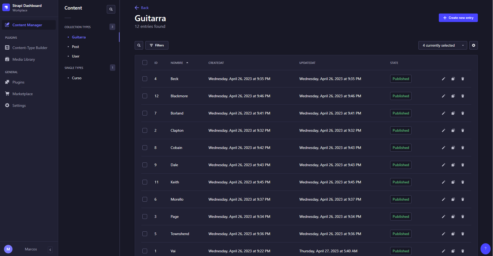

# Welcome to GuitarLA-Strapi 👋


[](#)

> La tienda de guitarras es un proyecto creado con Strapi que ofrece una plataforma en línea para comprar guitarras y accesorios. La aplicación web cuenta con un catálogo de productos fácil de navegar y un proceso de compra seguro y eficiente. Strapi se utiliza como CMS para gestionar el contenido y el proyecto es altamente personalizable.


## Installation

```sh
npm install
# or
yarn install
```

## Dev

```sh
npm run dev
# or
yarn dev
```

## Start


```
npm run start
# or
yarn start
```

## Build

```
npm run build
# or
yarn build
```

## Author

👤 **Marcos Alanya**

* Website: https://portafoly-site.netlify.app/
* Github: [@MarcosAlanya19](https://github.com/MarcosAlanya19)
* LinkedIn: [@MarcosAlanyaPacheco](https://www.linkedin.com/in/marcosalanya19/)
